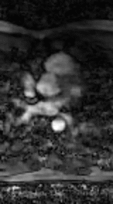
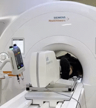

# Motion Robust Volumetric CMR 
<h2>(Rest-Exercise 3D cine & 4D flow MRI)</h2>

This repository contains the implementation of volumetric CMR reconstruction algorithms discussed in the research article, **["Motion-robust free-running volumetric cardiovascular MRI"](http://doi.org/10.1002/mrm.30123 )**, published in Magnetic Resonance in Medicine (MRM) journal. The primary focus of this project is our innovative reconstruction algorithm, CORe (Compressive Recovery with Outlier Rejection), which is specifically designed to suppress motion artifacts.

<table>
  <tr>
    <td colspan="2" align="center">
      <h3>Rest Imaging</h3>
    </td>
  </tr>
  <tr>
    <td align="center">
      
      
<em>Motion artifact reduction using CORe against CS in 4D flow</em>

    </td>
    <td align="center">
      
      
<em>Motion artifact reduction using CORe against CS in 3D cine</em>

    </td>
  </tr>
  <tr>
    <td colspan="2" align="center">
      <h3>Exercise Imaging</h3>
    </td>
  </tr>
  <tr>
    <td align="center">
      
      
<em>Motion artifact reduction using CORe against CS in 4D flow</em>

    </td>
    <td align="center">
      
      
<em>In-magnet exercise during acquisition</em>

    </td>
  </tr>
</table>

## About the Project

The "Motion Robust CMR" study aims to address the challenges posed by motion artifacts during 3D cine and 4D flow imaging at rest and during exercise. Our proposed reconstruction algorithm, CORe incorporates outlier rejection to suppress motion artifacts. This work compares the performance of CORe against known reconstruction algorithms in different volumetric CMR techniques and scenarios, discussed in our [research work](http://doi.org/10.1002/mrm.30123). The results demonstrate significant improvements in image quality and robustness in scenarios where motion artifacts are unavoidable.

### Key Features
- Introduction of CORe (Compressive Recovery with Outlier Rejection), a novel method equipped with outlier rejection to improve motion robustness.
- Implementation of known CMR reconstruction algorithms for comparison, such as:
  - Compressed Sensing 'CS' (Lustig et al., 2008)
  - Robust Regression 'RR' (Nikolova et al., 2004)
  - Sparse Outliers 'SO' (Dong et al., 2012).
- Multiple studies on the comparison of algorithms:
   - Study I: Static phantom
   - Study II: Dynamic phantom
   - Study III: High-resolution 3D cine
   - Study IV: Rest 4D flow
   - Study V: Stress 4D flow
- ADMM (Alternating Direction Method of Multipliers)/Split Bregman implementation of reconstruction algorithms.

## Getting Started

To use these algorithms, clone the repository and follow the setup instructions provided below.

### Installation

Requires MATLAB 2019 or later.

### Usage
- Study I and II utilize simulated phantom data, which is generated directly within the main MATLAB script.
- Studies III, IV, and V employ in-vivo CMR datasets, available at [Cardiovascular MRI (CMR) 3D Cine, 4D Flow, and Exercise Stress 4D Flow Datasets](https://zenodo.org/records/12515230).

### [Datasets](https://zenodo.org/records/12515230)
The datasets for Studies III, IV, and V consist of Cartesian undersampled acquisitions with self-gating. The provided .mat files contain self-gated expiratory phase k-space data, sorted into 20 cardiac phases.

### Cite as:

Arshad SM, Potter LC, Chen C, et al. Motion-robust free-running volumetric cardiovascular MRI. Magn Reson Med. 2024; 92(3): 1248-1262. doi: [10.1002/mrm.30123](http://doi.org/10.1002/mrm.30123).

## Authors 

- **Syed Murtaza Arshad**, Primary Developer, [GitHub Profile](https://github.com/syedmurtazaarshad), arshad.32@osu.edu
- **Rizwan Ahmad**, PI, [GitHub Profile](https://github.com/OSU-CMR), ahmad.46@osu.edu
